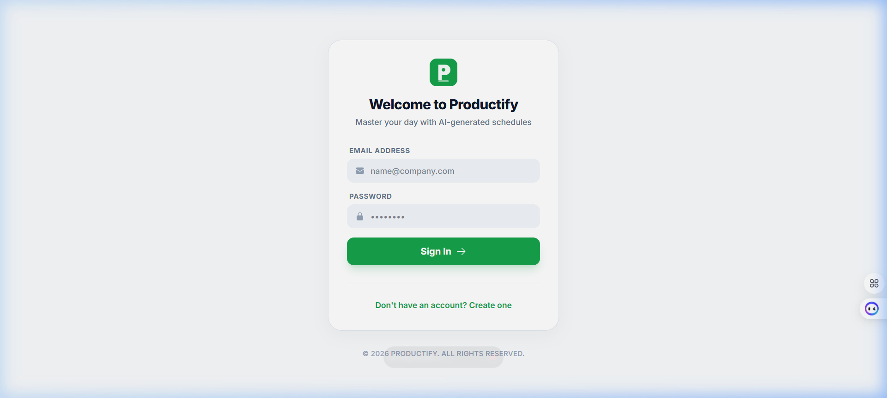
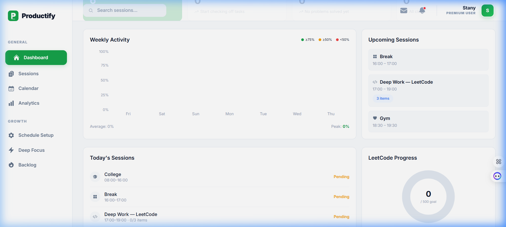
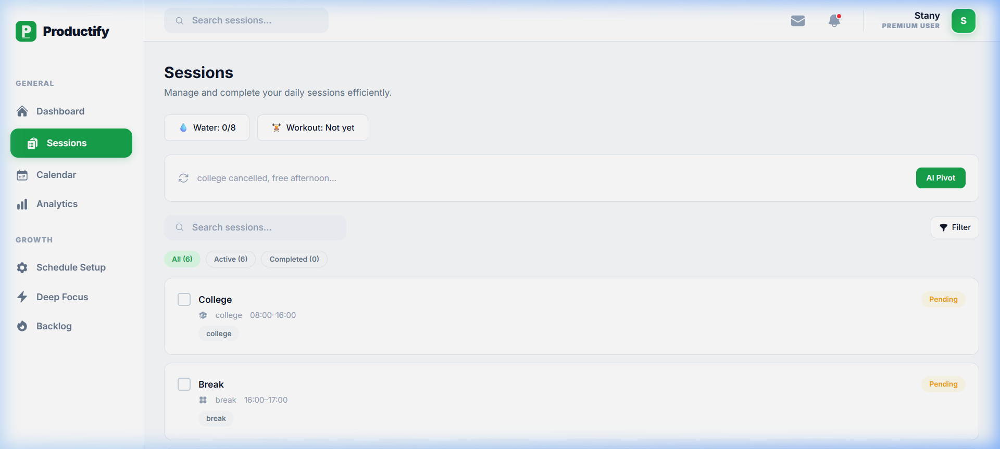
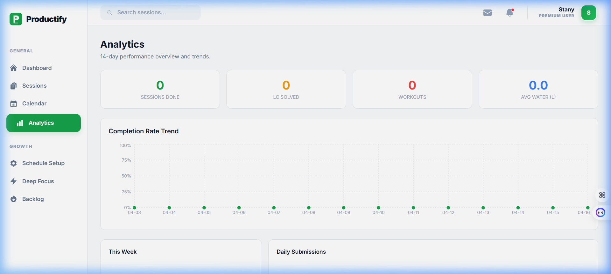
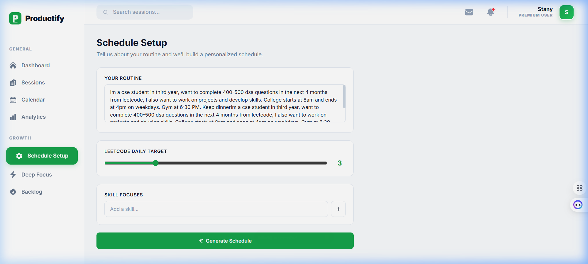
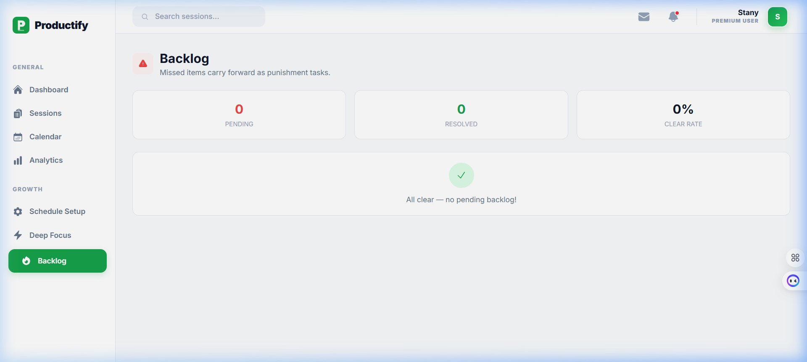

<div align="center">



# Productify

**AI-powered daily scheduler, habit tracker, and accountability engine**

[](https://productify-pi.vercel.app)
[](#tech-stack)

</div>

---

## Screenshots

<table>
  <tr>
    <td><br/><sub><b>Dashboard</b> — weekly activity, upcoming sessions, LeetCode progress</sub></td>
    <td><br/><sub><b>Sessions</b> — AI-generated daily agenda with checkboxes and AI Pivot</sub></td>
  </tr>
  <tr>
    <td><br/><sub><b>Analytics</b> — 14-day completion trends and habit stats</sub></td>
    <td><br/><sub><b>Schedule Setup</b> — describe your routine, AI builds the schedule</sub></td>
  </tr>
  <tr>
    <td><br/><sub><b>Backlog</b> — missed tasks carry forward as accountability debt</sub></td>
    <td></td>
  </tr>
</table>

---

## Features

- **AI Schedule Generation** — Describe your day in plain English; Groq AI builds a full session plan
- **AI Pivot** — Life changed? Tell Productify (e.g. "college cancelled, free afternoon") and it rebuilds the rest of your day on the fly
- **Optimistic UI** — Checkboxes respond instantly; API syncs in the background
- **Punishment Backlog** — Incomplete tasks roll forward into a "debt queue" you must clear
- **LeetCode Integration** — Pulls your daily submission count via LeetCode GraphQL; shows verified badges per question
- **Analytics** — Completion rate trend, habit tracking (water / workout), weekly bar chart
- **Deep Focus Mode** — Built-in Pomodoro-style focus timer
- **Browser Notifications** — Alerts 30 min and 10 min before sessions start
- **JWT Auth** — Secure per-user data isolation

---

## Tech Stack

| Layer | Tech |
|---|---|
| Frontend | React 19, Vite, Tailwind CSS v4, Framer Motion, Recharts |
| Backend | Node.js, Express (serverless via Vercel Functions) |
| Database | MongoDB Atlas (Mongoose) |
| AI | Groq SDK (`llama-3.3-70b-versatile`) |
| Auth | JWT + bcryptjs |
| Deployment | Vercel |

---

## Local Development

### Prerequisites
- Node.js 18+
- [MongoDB Atlas](https://cloud.mongodb.com/) free cluster (or local MongoDB)
- [Groq API Key](https://console.groq.com/keys)

### Setup

```bash
# 1. Clone
git clone https://github.com/Stany87/Productify.git
cd Productify

# 2. Install
npm install

# 3. Create server/.env
MONGODB_URI=mongodb+srv://<user>:<pass>@cluster.mongodb.net/productify
GROQ_API_KEY=gsk_...
JWT_SECRET=your_secret_here
PORT=3001

# 4. Run backend (terminal 1)
node server/index.js

# 5. Run frontend (terminal 2)
npm run dev
```

Open **http://localhost:5173** — API proxies automatically to port 3001.

---

## Deploy to Vercel

```bash
npm i -g vercel
vercel login
vercel --prod \
  -e MONGODB_URI="your_uri" \
  -e GROQ_API_KEY="your_key"
```

Or import the repo at **https://vercel.com/new** and set the environment variables in the dashboard.

> **MongoDB Atlas**: Make sure to whitelist `0.0.0.0/0` in Network Access → IP Allowlist so Vercel's dynamic IPs can connect.
